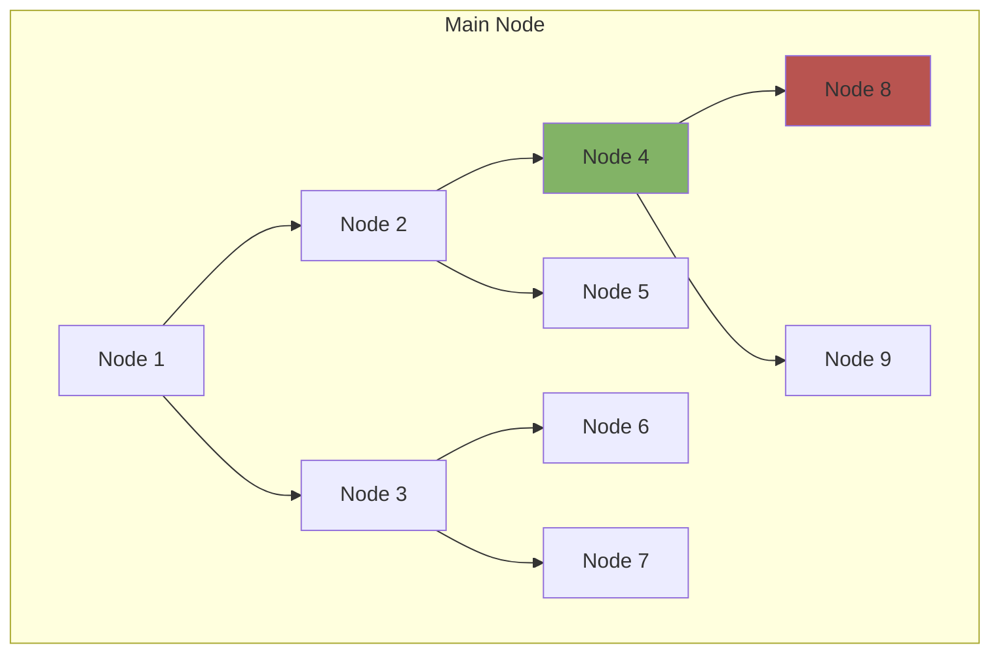
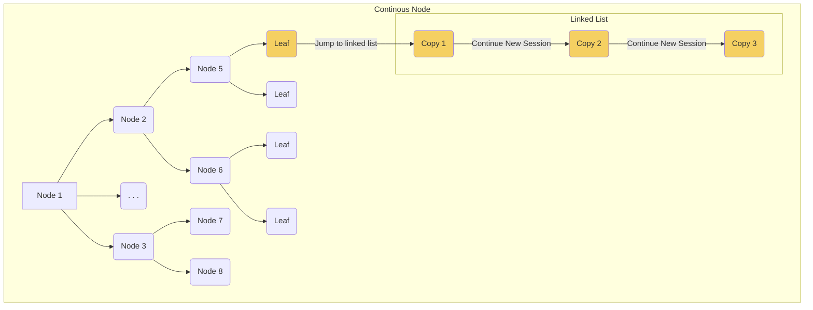
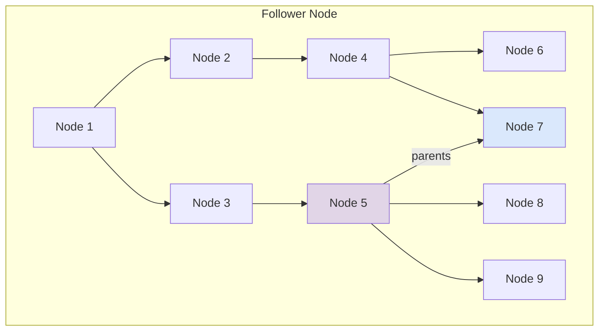
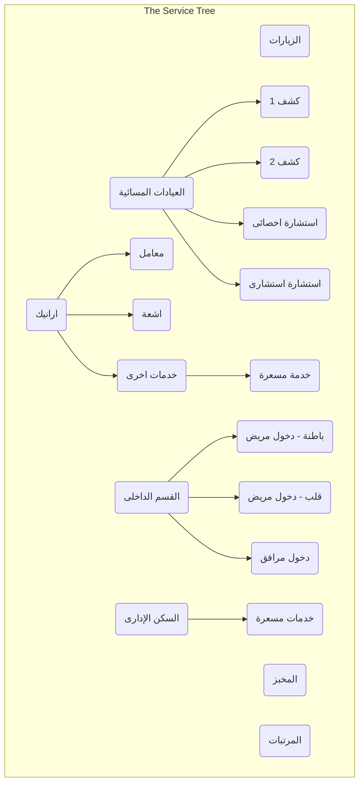

# Medical Complex Services

This system wraps up several currently used modules such as: "منظومة العسكريين", "برنامج الكاشير", "التذاكر", "المخبز", etc.  It was developed to meet the requirements of having a generic system that is reliable, scalable, and realistic. 

[[_TOC_]]

# Modules

## General Glossary

**System Worker** (sometimes shortened as worker): the entity which is able to register a service for a consumer. 

## Visitor Services

The module wraps up the following submodules:

- Tickets
- Financial System Administration Panel
- Night Clinics
- Financial System (Windows)
- Financial System (Web-based)

### Service Design

Follow the diagram shown as a reference for building services and their sub*services (asterisk refers to any level of sub services)

#### Nodes

##### Types 

A service node has four types (they are not mutually exclusive, i.e., a node can have multiple types), check the diagram.

###### Main
Has no special architecture, it just has an associated price (either fixed or variable) and is consumed with no pre-requisites

###### Continous

Example: consider you have a continous leaf node (let's call it master), then an associated linked list is created with each node of the list being a typical copy of the master node receipt or attributes except the price, it can be either 0 or any number less than or equal to the master node price. However, keep in mind the total sum of that linked list has to equal the master node price (you should check everytime you add an extra node to the linked list).

###### Follower

- A follower node, there has to be constraints for other followed transactions (or nodes) in order to register this follower node.
- Service designer chooses which node to follow (it's a must), the node can be located at any level. 
- Service designer chooses the constraints and can allow that the constraint can be violated.
- Constraints are choosen dynamically from the schema. 
    > For example: if in the schema there's a date attribute, constraint can be that the date can be the difference between the current transction (which is the follower node) date and the previous transactions date that satisfy the constraitns is 15 days. 
- Same user constraint.

###### Postponed

Postponed service is a service which is not closed immediately, it can be closed later. (e.g. القسم الداخلى).

- The use case of 'القسم الداخلى'

    - The service of 'القسم الداخلى' has two sub-services: ('دخول مريض', 'دخول مرافق').
    
    - There are two variable price types: (Immediate, Postponed).
    
    - The immediate variable price will be assumed to be paid immediately at the begining of the service consumption, e.g. 'تأمين الدخول'.

    - The postponed variable price will be assumed to be paid later when the service is about to be closed, e.g. 'الاقامة و التليفزيون'.
    
    - The postponed variable price is calculated according to the duration (the difference between the service start date and finish date).
    
    - The parameter for the postponed variable price is saved as a 'price per day'.
    
    - Any other service (e.g. الاشعة) must only has 'use from wallet' option if the consumer has already in a postponed service which is not closed yet.
    
    - Rank is linked with Service in a constrained relation to allow or disallow some things for services according to the rank.
    
    - If the service is of type follower and postponed together like 'دخول المرافق', it must be closed first before the main one (دخول المريض).
    
    - Each service has a department_id (if necessary).
    
    - Each service has a boolean variable 'require_doctor'.
    
    - The Doctor should be linked to the Transaction.

#### Definitions 
- Service node with no consumer option has to allow the system worker to cashout the node a number of times (e.g., cashout five visit tickets)

### Module Glossary

**Service**: represents any service that can be registered (or consumed) to a benefit of a service consumer (definition follows). 

**Service Consumer**: the entity which is able to consume the registered services.

**Service Transaction**: represents a single consumption to a service by a service consumer.

**Service Stakeholder**: this can be anyone on the system able to consume a service, i.e., a service consumer or a system worker.

**Service Associate (or related) Consumer**: any service consumer who gets a benefit according to being related to another service consumer.

**Utilities**: 

    - Barcode

> For example: A parent of a consumer with rank general gets a discount of 75%. This parent is considered a service associate consumer.
If a patient (generally, a consumer) is in a room, and someone wants to stay with them, this "someone" is considered a service associate consumer.

### Functional Requirements

#### Global

##### Stakeholder Wallet

- Each wallet value can be either positive or negative. 
- A system worker can add receipt change on the stakeholder wallet.
- The visitor service module admin can collect the money from the wallet. The money is transferred to the collector's wallet. 
- A system worker cannot collect from his/her own wallet.
- A system worker can choose to cashout from/transfer to the consumer wallet credit or not.
- A consumer should be blocked from consuming more services, if he/she has negative values in wallet. (عليه فلوس)

##### Stakeholder Querying

System workers have to choose the consumer before registering any service, this will be done through querying all stakeholders (not just consumers, so that we allow the system workers to consume services too without registering them again as consumers)

###### Querying options

1. Consumer code (which is retrieved from "الرعاية الصحية")
1. Consumer name
1. national identity number
1. The system given code
1. The system stakeholder anchor (i.e., the field which the system will use to uniquely identify the stakeholders) is the generated code whenever a stakeholder (either consumer or system worker) is added to the system. This field should be treated exactly as the consumer code retrieved from "الرعاية الصحية" (e.g., printed on receipts, can be used to search for consumers, etc.)
1. Any other fields designed for the stakeholder entity.
1. Showing recent transactions that consumer did before, to detect he is the right consumer.

##### System Workers Management

- There has to be department name for each user .
- There has to be an account type(role) that describes entities ("المجمع الطبي", "ادارة الخدمات الطبية", "معمل نظم المعلومات"). This type of accounts shouldn't be allowed to 
    - Login 
    - Make transactions.

##### Services Management

##### Transactions Management

##### Reports

- Per field transaction reports (e.g., user, date, place, etc.) on a chosen period of time (from-to date).
- Current consumers 

##### Supporting Service Features
Each Service will be able to support some externally developed features (in coding terms, it should not be implicitly coded with the tree data structure, but externally developed and does its processing on the service tree as an input object):

- Timed nodes (at any tree level)
    - The service designer should be able to give permissions to system workers who can add the days and the time (e.g.,  مستخدمي قسم العلاقات العامة)
- Service priced leaves (plural of leaf) can put some remainder money to the consumer wallet.
- Each system worker (not group of system workers) has to have a timeframe only in which the worker will be able to subscribe to a service (or be subscribed by another system worker). This can be chosen through a couple of ways:
    - The worker chooses it.
    - Other users with the privilege of choosing timeframes for system workers.
        - Only the super admin of the visitor services module can choose system workers (probably from public relations department) who can select the timeframes for the other system workers. 

##### Service Stakeholder Associates

A service node can support having stackholder associates which are also consumers that are allowed to consume the main consumer transaction. 

- Associates are linked with the consumers
- Associates have types (just as the consumers)
- They could be in the same entity (or table if needed). Both associates and consumers can be sometimes the main consumer or related consumer to the service. For example: in the case of "التذاكر", when somone comes to visit a patient, the main consumer is a consumer of type visitor where the related consumer is the consumer of type patient.
- Enable or Disable Limited number of Associate Types. For example, if enabled, the service consumer cannot have more than two associates of type friend. If disabled, the consumer can have infinite associates of any types. 

> E.g., in the case of "القسم الداخلي", when a consumer is consuming this service (who is considered in this case a patient type), the service designer can choose that a sub-service can be consumed by multiple consumers (of different types, most likely type "مرافق" and also how many can be added) with also defining who is the main consumer (who will have the subservice price added to his/her wallet optionally or cashedout to a current payer) 

> Keep in mind that a certain associate type (e.g., visitor) may not have all required fields (such as name, id no., age, etc.) for a different type (e.g., patient). However, if the first time the consumer was registered as visitor and only few fields were registered, if the same consumer tries to consume a service as a patient, the system should prompt the worker to submit the other requried fields. 

##### Service RegistrationPrice Criteria

##### Pricing and Billing

There are two factors controlling the price:

- Service node price.
- Financial categories pricing criteria (الفئات المحاسبية, e.g. والدين و اجنبيين و تعاقدات) +, -, *, /.
    - The pricing criteria is applied during transaction creation by choosing which financial category the consumer follows and saves the category to the transaction details

###### Pricing Types

A service node price can be fixed or variable.

- A variable price will be saved as a string equation with generated names of variables (in the frontend when the service designer decides the pricing equation), the descriptions of these keys are provided by the service designer and stored in a table (ensure that the variables in the equation are equal to the variables added)
- The calculation is done in the backend by replacing the variables keys with the values from the frontend when the system worker tries to issue a transaction for a consumer.
- Either fixed or variable, the price is transferred to certain account wallets according to a criteria decided by the service designer.
    - Each price is distributed to several accounts *(let's call it a price distribution tree)*
- A service designer can add as many accounts (or nodes to the tree) as he/she wishes however, with validating that the total of the distribution never passes the service price. 
- The service designer should be able to distribute price to account using two possible ways:
    1. Percentage
    1. Fixed Distribution Amount
- The system should keep history of distribution amounts if they were edited. 
    - Anoynmously (i.e., without the system worker knowing it), you should create a new price distribution tree and all next transactions will use it (as if you were activating it instead of the previous one).

######  Payment Types (Billing Options)

A service transaction billing can have several payment types:

- Cash
This should be added to the system worker wallet cash.
- Visa
The process of paying through credit cards is done as follows:
    1. When the consumer is about to consume a service and pay through credit card, The system prints a credit card receipt with the required amount (cost).
    1. The consumer goes to a specific department in the Financial Dept. to pay through credit card.
    1. The system worker writes the paid receipt number, the system checks if the consumer has already paid, then the service is consumed successfuly.
    1. Another solution is to allow the credit card system worker to consume the service for the consumer directly to prevent the consumer from going to many workers.
*(discuss with Financial Dept. Manager)* whether should we add to wallet details that the system worker has done transactions of type Visa with total of [NUMBER] and the system worker is expected to have receipts equal to the number of transactions made in Visa.
- Use from wallet (credit like Uber).

###### Billing 

Each service node has a separate checkout panel after filling its details, where the system worker has the option to use credit from customer wallet or not. Price should be dimmed after the system worker chooses to cashout from the wallet. 

### Monitoring

- Dashboard to view all services transactions in a real-time (i.e., using AJAX)
- Service Stress Usage
### Submodules Wrapped

#### Tickets 

##### Consumer

Consumer is the patient visitors are visiting

##### Requirements

- Login
    - Privilege
    - IP and Mac Address validation

- Visit Ticket
    - With the place it was printed from.
    - Print number of tickets
    - The consumer to this subservice will be the patient; however, the billing will be cashedout to the visitor (who will not be registered to the system)

- (Discuss): integrating with the enquires system
    - The enquires system will be kept as a separate module, however, intergates with tickets by asking the visitor to whom is he/she going and print the patient details on the ticket. 
#### Bakery

##### Consumer

No consumer.

##### Requirements

Follows the same tickets architecture

####  Night Clinics

##### Consumer

Consumer of type patient.

##### Requirements
- Medical checks are associated with specializations (not hospitals or clinics)
- Activate timetable from admins
- Only allow chosen medical checks to doctors.

#### Financial System Administration Panel
Global requirements satisfies this service requirements. 
#### Financial System (Windows)
Requirements will be collected from the Financial System manager
#### Financial System (Google Chrome)
- Main services with priced sub-services:
    - the service is made to a patient with his/her patient code.
    - print the receipt.
- Medical Salaries
    - Military and their families.
    - Parents (or associates)  pay only 25% of the price
    - The user should choose the number of months and items.
    - Print the receipt.
- Internal Patients:
    - Entering a patient
    - Outing a patient
    - Entering an associate with a patient( have two options: inside or outside the medical card)
    - Money remainder option

## Garage

### Scenario Flow

When a driver is getting into the parking, the flow of the steps they do is:

1. The driver stops by the ticket kiosk
1. The driver shows his/her driving license.
1. The System Worker scans the driving license
1. Side photo of the driver

### Functional Requirements

#### Driver

##### Pre-assumptions

* A driver is expected to have either one or multiple car.

#### Pricing

##### Daily

if it's a daily visit, pricing is measured through the following criteria:

* Each hour in the spent hours inside the parking has different price decided by the administration.

    For example: The driver spent 5 hours:
    - Hour 1: 5 L. E.
    - Hour 2: 3 L. E.
    - Hour 3-5: 1 L. E.

* There is a maximum price limit chosen per number of hours
    For example: The driver spend 26 hours.
    - Price is 25 L. E if number of hours passes 24 hours.

##### Subscribtion

* For each subscribtion, there has to be a financial categories where the price differs for each.

    For example:
    - Non-Military Citizens Subscribtion: 150 L. E.
    - Soliders Subscribtion: 120 L. E.
    - Officers Subscribtion: 90 L. E.

* The module should automatically reject the subscribtion if it expired. 

#### Entrace and Leaving

* Each transaction calculation is done through scanning a barcode (that is given at the driver entrance) on leaving. 
* Whether the driver visit is a subscribtion or daily, system worker should register their visit (if it's a subscribtion, you should add it to the driver history). 
* On leaving the recepit should contain the following fields, fields should be personalized and shouldn't contain general information (such as prices for different driver category)
    * Driver name.
    * Price.
    * Driver category.
    * Daily visit or Subscribtion .
    * Fines with their reasons.

#### Administration 

There has to be an auditing panel where the admin is able to detect fraud transactions. 

##### Offline Workaround
In case the main system goes off, the system worker is expected to start using paper to register the incoming drivers. However, when the main system comes back, there has to be an administration panel that allows:

* Adding a driver visit
* Checking out a driver visit
* Print receipts

#### Reports

The module should use the system's reporting engine to provide the module administrator some beneficial details about the module. 

# Database ERD

# Database ERD Description

1. **Stakeholder**: Any person that uses the system, it may be a system worker, doctor, or consumer, or any other group.
Not all stakeholders can have login credentials. 
    - Attributes:
        - name: the name of the person, all person names should be saved here in the stakeholder table.
        - barcode: a barcode number will be associated with any stakeholder.
        - wallet: the amount of money that the system worker should pay, and the amount of money that the consumer has, it may be positive or negative.
        - patient_code: it may be optional in some cases (رقم الحاسب).
    - Relations:
        - Rank (m - 1): each stakeholder **must** have a rank.
        - Service (m - n): any stakeholder may be blocked to any service. This relation is intended to block very specific stakeholders to any service.
        - Stakeholder (recursive): to support the relations between stakeholders (العائلات).

1. **Consumer**: Any visitor or patient that consumes a service. It inherits from Stakeholders.
    - Attributes:
        
    - Relations:
        - Transaction (m - n): many consumers (main or associates) can be related to one transaction.

1. **SystemWorker**: The users of the system that have login. It inherits from Stakeholders.
    - Attributes"
        - username: the login of the username.
        - password: the password of the user.
    - Relations:
        - Module (m - n): each system worker will be able to access some modules.
        - PC (m - n): each system worker should have access to open the system according to the PC.
        - Role (m - 1): each system worker has a specific role, roles control many things like permissions.
        - Transaction (1 - m): a transaction is made by only one system worker.

1. **Doctor**: Inherits from SystemWorker.
    - Attributes:
        
    - Relations:
        - SystemWorker (inheritance): Doctor inherits from SystemWorker as it **may** have login username and password.
        - Department (1 - m): each doctor should be in a department, e.g.(باطنة، رمد).
        - Transaction (m - n): each doctor can make many transactions, a transaction can be made with many doctors, the first doctor **must** be in the same department of the service, the optional other doctors **may** be from other departments. Example: A heart internal department can have a main doctor for a surgery, and another doctor for (التخدير).
        - Degree (m - 1): each doctor should have a degree(استشارى، اخصائى، استاذ).

1. **Rank**: The normal ranks including (العائلات ، مدنى مصرى ، مدنى أجنبى).
    - Attributes:
        - name: the name of the rank (جندى، ملازم، حرم ملازم، ...).
    - Relations:
        - FinancialCategory (m - 1): financial cetegories **may** be linked with ranks to be automatically suggested.
        - RankPriceVariable (m - n)

1. **Degree**: The degree of the doctor: استشارى، اخصائى، استاذ.
    - Attributes:
        - name
    - Relations:

1. **Module**: A separate module like Visitor Services, or Garage. Modules are like tabs or cards in a dashboard.
    - Attributes:
        - name: the name of the module (خدمات الزائرين، الجراج).
    - Relations:
        - PC (m - n): each module can be accessible for specific PCs.

1. **PC**: The pc information, each device that opens the system, should be automatically registered in this table.
    - Attributes:
        - name: the name of the pc, it's optional, the admin should register the names of the PCs.
        - ip: the ip address of the PC that opens the system.
        - mac: the mac address of the PC that opens the system. 
    - Relations:
        - Service (m - n): each service **may** be allowed only on some PCs.
        - Transaction (1 - m): any transaction **must** be made on one PC.

1. **Permission**: Should have the control of the UI permissions according to system workers' roles.
    - Attributes:
        - name: the name of the UI component.
    - Relations:
        - Role (m - n): specify the relation between the permissions according to the roles.

1. **Department**: groups of the doctors, like (باطنة، قلب ...) 'only for doctors'.
    - Attributes:
        - name: the name of the department.
    - Relations:

1. **Role**: Roles of the system workers that controls the permissions 'only for system workers'.
    - Attributes:
        - name: the name of the role (قسم مالى، أطباء).
    - Relations:

1. **Service**: This table should have the service design tree structure.
    - Attributes:
        - name: the name of the service, e.g.(المرتبات العلاجية).
        - fixed_price: in case of fixed price services, it should be the fixed price of the service.
        - timed: a boolean attribute that specifies if the service should be closed in specific intervals and days or not, 
        e.g. (العيادات المسائية من 2 ل 4).
        - main_consumer_number: the number of main consumers of the service, it should be zero in case of (خدمة الزيارات) as it does not
        require any consumers. (until now it should be zero or one only).
        - associate_consumer_number: the number of associates for each service, for example, it should be one for (المرتبات العلاجية).
        - variable_price_equation: the string equation that calculates the service price, the equation consists of two main attributes:
            - parameter: got from DB (RankPriceVariable).
            - variable: got from user (UI).
        - requires_doctor: to indicate if the service requires a doctor to be consumed or not.
    - Relations:
        - Service (recursive, tree design).
        - Role (m - n): each service has the roles of **system workers** that are allowed to register the service.
        - Department (m - 1): each service **may** have a specific department of **doctors** to be completed, like in (الكشوفات).
        - ServiceType (m - 1): each service **must** have a type (main, continous, follower).
        - ClosedInterval (1 - m): each service **may** have time intervals in which they are not accessible.
        - PriceType (m - 1): eah service **must** have a pricing type (fixed, variable).
        - VariableLabel (1 - m): each service **may** have many variables each with a label (only in variable price).
        - BillingOption (m - n): each service **may** have another options for billing to allow the system worker to choose from them (cash, use from wallet). A code like (رقم الفاتورة - رقم التسجيل) **may** be saved.
        - FinancialCategory (m - n): each service **may** have options for financial categories to allow the system worker to choose from them (اجنبى، والدين).
        - LinkedNodes (1 - m): each **continous** service may have many linked nodes (جلسات).
        - FollowerConstraint (m - n): each **follower** service should have constraints on its consumption, these constraints are between the follower service and the main service intended to be followed , each constraint may be active or not. Constraints are like: date difference between follower and main service (15 days), and if the same doctor should be in the two services or not.
        - Transaction (1 - m): each transaction must made on one service.
        - Rank (m - n) (constrained relation): to control the differences inside the service according to the ranks.
        - Degree (m - n): each service **may** be valid for specific degree only.

1. **ServiceType**: Main, continous, or follower.
    - Attributes:
        - name
    - Relations:

1. **ClosedInterval**: An interval which a service should be closed within.
    - Attributes:
        - day: (sat, sun, ...).
        - from: from specific time.
        - to: to specific time.
    - Relations:

1. **VariableLabel**: A dictionary which maps generated variables to labels (used for variable price equations).
    - Attributes:
        - key: the generated key for the variable (X1, X2, ...).
        - label: the description of the variable like (عدد الأصناف).
        - data_type: number or boolean.
        - time_type: immediate or postponed.

    - Relations:
        - RankPriceVariable (1 - m): some variavles (parameters) **may** have different values according to ranks.

1. **PriceType**: Fixed price or variable price.
    - Attributes:
        - name
    - Relations:

1. **RankPriceVariable**: To save values for (rank, parameter) pairs. (e.g. (ملازم, سعر الصنف) -> 3 EGP).
    - Attributes:
        - price_value: the value that should be substituted for the parameter, like ( سعر الصنف للملازم ).
    - Relations:

1. **BillingOption**: Immediate cashout or use wallet credit.
    - Attributes:
        - name
    - Relations:

1. **Transaction**: Each operation (consumption) for a service should be saved here.
    - Attributes:
        - time: the time of the transaction.
        - printing_count: the number of times the receipt was printed.
    - Relations:
        - Transaction (recursive, following): each follower-type service transaction **may** be linked to a main-type service transaction (sibling node in the service tree) on satisfying the following constraints.

1. **FinancialCategory**: (الفئات المحاسبية: والدين، اجنبى، شركات) Financial categories can be automatically detected if it's linked with ranks.
    - Attributes:
        - name
        - operator: (+, -, *, /).
        - value: (0.25, 2, ...).
        - max_limit: a value that upon it, there is no discount (e.g. علاج الوالدين 200 جنيه حد اقصى).
    - Relations:
        - Transaction (1 - m): each transaction **may** have one financial category to modify (increase/decrease) price.

1. **LinkedNodes**: The linked copies of services (to support continous services).
    - Attributes:
        - name
        - price: the amount of money the consumer payed for each linked node (لكل جلسة).
    - Relations:

1. **FollowerConstraint**: the constraints that should be satisfied to accept a follower service to be consumed.
    - Attributes:
        - name
        - active: to allow the constraints to be violated.
    - Relations:

# The Service tree

## Service Configurations
- **Visits**
    - name: الزيارات
    - service type: main
    - price type: fixed
    - variable_price_equation: Null
    - main consumer number: zero
    - associate consumer number: zero
    - billing options: cash only
    - timed: true
    - department: Null
    - requires_doctor: false 
- **Bakery**
    - name: المخبز
    - service type: main
    - price type: fixed
    - variable_price_equation: Null
    - main consumer number: zero
    - associate consumer number: zero
    - billing options: cash only
    - timed: false
    - department: Null 
    - requires_doctor: false 
- **NightClinics**
    - name: العيادات المسائية
    - service type: main
    - price type: Null (can't be consumed)
    - variable_price_equation: Null
    - main consumer number: zero
    - associate consumer number: zero
    - billing options: Null
    - timed: true
    - department: Null
    - requires_doctor: true
        - **Kashf** (many services)
            - name: اسم الكشف
            - service type: main or continous
            - price type: fixed
            - variable_price_equation: false
            - main consumer number: one
            - associate consumer number: zero
            - billing options: cash or wallet
            - timed: true
            - department: department_id
            - requires_doctor: true
        - **Estshara**
            - name: اسم الاستشارة(استشارة اخصائى، استشارة استاذ، استشارة استشارى)
            - service type: follower
            - price type: fixed
            - variable_price_equation: Null
            - main consumer number: one
            - associate consumer number: zero
            - billing options: cash or wallet
            - timed: true
            - department: department_id
            - requires_doctor: true

- **Medicine**
    - name: المرتبات العلاجية
    - service type: main
    - price type: variable
    - variable_price_equation: item price (parameter) * items no. (variable) * months (variable)
    - main consumer number: one (العائلات)
    - associate consumer number: one (العائل)
    - billing options: cash or wallet
    - timed: fasle
    - department: Null
    - requires_doctor: false 
- **Aranek**
    - name: الأرانيك
    - service type: main
    - price type: variable
    - variable_price_equation: price (parameter)
    - main consumer number: one
    - associate consumer number: zero
    - billing options: cash or wallet
    - timed: false
    - department: Null
    - requires_doctor: false 
- **Internal**
    - name: القسم الداخلى
    - service type: main
    - price type: Null (can't be consumed)
    - variable_price_equation: Null 
    - main consumer number: zero
    - associate consumer number: zero
    - billing options: Null
    - timed: false 
    - department: department_id
    - requires_doctor: false
        - **PatientIn**
            - name: دخول مريض
            - service type: postponed
            - price type: variable 
            - variable_price_equation: (TV(boolean variable) * TV price (parameter) + stay price (parameter)) * duration (automatically calculated)
            - main consumer number: one
            - associate consumer number: zero
            - billing options: cash or wallet
            - timed: false
            - department: department_id
            - requires_doctor: fasle
        - **MorafkIn**
            - name: دخول مرافق
            - service type: postponed, follower
            - price type: variable 
            - variable_price_equation: in card (boolean variable) * stay price for in card (parameter) * duration + ! in card (boolean variable) * stay price for out card (parameter) * duration
            - main consumer number: one (patient)
            - associate consumer number: one (Morafek)
            - billing options: cash or wallet
            - timed: false
            - department: Null
            - requires_doctor: false  
- **Home**
    - name: السكن الإدارى
    - service type: main
    - price type: fixed
    - variable_price_equation: Null
    - main consumer number: one
    - associate consumer number: zero
    - billing options: cash or wallet
    - timed: false
    - department: Null
    - requires_doctor: false

# Frontend Design (Vue Project Structure)

## Pages

- Login
- Modules
- UserProfile
- ServicesMainPage
- ConsumerFinding
- DoctorFinding
- PricesPage
- BillingPage

- Admin
    - Reports
    - TransactionsHistory
    - Users
    - Modules
    - Services
    - FinancialCategories
    - Departments
    - Doctors
    - PCs

## Layouts

## Components

